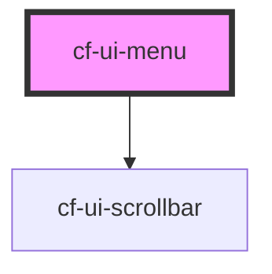

# cf-ui-context-menu

<!-- Auto Generated Below -->

## Properties

| Property  | Attribute | Description | Type                         | Default                              |
| --------- | --------- | ----------- | ---------------------------- | ------------------------------------ |
| `height`  | `height`  |             | `string`                     | `undefined`                          |
| `items`   | --        |             | `MenuItem[]`                 | `[]`                                 |
| `options` | --        |             | `MenuOption`                 | `{     positioning: 'document',   }` |
| `type`    | `type`    |             | `"contextmenu" \| "trigger"` | `'trigger'`                          |

## Shadow Parts

| Part          | Description |
| ------------- | ----------- |
| `"menu"`      |             |
| `"menu-item"` |             |
| `"scrollbar"` |             |

## Dependencies

### Depends on

- [cf-ui-scrollbar](../scrollbar)

### Graph

----------------------------------------------

*Built with [StencilJS](https://stenciljs.com/)*
